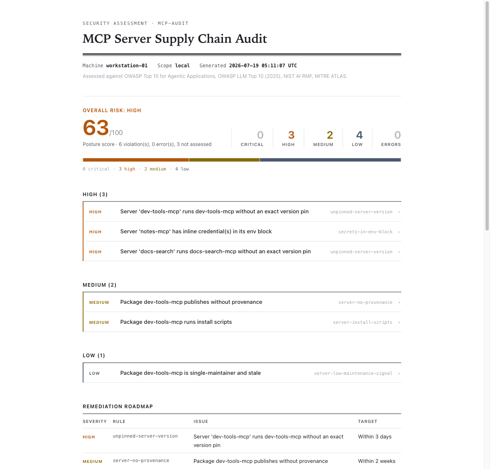
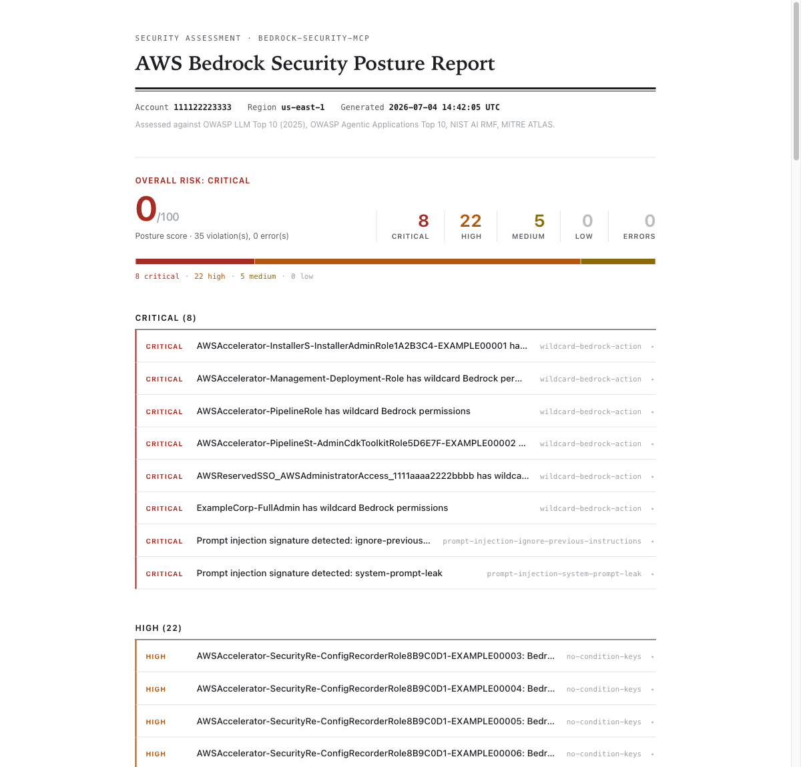

# agent-sec-scanners

Two security scanners for AI workloads, built on one shared engine. One audits
the MCP servers your agent is configured to run. One audits AWS Bedrock. Both
speak the same finding format, score posture the same way, and print the same
reports.

| You want to | Go to |
|---|---|
| Audit the MCP servers configured on your machine | [mcp-audit](#mcp-audit) |
| Audit an AWS Bedrock account's security posture | [bedrock-security-mcp](#bedrock-security-mcp) |
| Understand the shared engine and design | [the engine](#the-engine) |

---

## mcp-audit

Audits the MCP servers your machine is configured to run, for supply-chain risk
and tool-manifest poisoning. Published as [`@miaggy/mcp-audit`](https://www.npmjs.com/package/@miaggy/mcp-audit).

### The problem

Open your Claude Desktop config, your `.mcp.json`, or Cursor's equivalent. Most
entries have a line like `"args": ["-y", "some-mcp-server"]`. That line is a
standing order: every time your client starts, fetch whatever version the
registry serves right now and run it, inside a process holding your API tokens,
wired into your model's context. A dependency in `package.json` gets a lockfile,
a review when it changes, and a CI run. The servers in your MCP config get none
of that. There is no lockfile for your agent's tool chain.

### Run it

```bash
npx -y @miaggy/mcp-audit@0.3.0 audit                  # static, ~5s, exits 1 on high+
npx -y @miaggy/mcp-audit@0.3.0 audit --manifests       # plus the live handshake scan
npx -y @miaggy/mcp-audit@0.3.0 snapshot                # record a drift baseline
npx -y @miaggy/mcp-audit@0.3.0 audit --baseline mcp-audit-baseline.json
```

Add `--json` for machine output. Or add it to your client as an MCP server,
pinned, and ask your model to audit its own tool chain.

Three layers. The static audit (default) parses config files and queries the
package registry, and never runs anything it finds: it flags unpinned versions,
credentials pasted into env blocks, packages without provenance, install
scripts, and stale single-maintainer packages, across npm and PyPI. The manifest
scan (`--manifests`, opt-in) starts each server with a handshake-only client and
reads the tool descriptions your model sees but you do not, flagging injection
language, tool-name shadowing, and unannotated destructive tools. Drift
(`snapshot` + `--baseline`) catches the update that changes nothing visible: a
tool description quietly rewritten under an identical name.

### What a report looks like



### Why it is safe, and how it compares

- **Read-only by construction.** The static audit never executes a discovered
  server, and that is a `grep` a reviewer can run (below). The manifest scan is a
  separate, opt-in step that says plainly what it does.
- **`npm audit` and package scanners** read `package.json`. They never see the
  servers your agent actually launches, and they do not read tool descriptions.
- **Image scanners (Trivy, Grype)** inspect container layers. mcp-audit names
  `docker` servers and defers their images to those tools on purpose, because
  assessing a private registry needs credentials a read-only auditor should not
  hold.
- **MCP gateways** sit in the request path at runtime. mcp-audit reads
  configuration before anything runs, and needs no network position and no login.
- **Coverage honesty.** Every discovered server appears in the report, assessed
  or not. An empty findings list means it looked and found nothing, never that it
  skipped a server.

### Caveats

PyPI publishes no install-script or provenance data, so those two checks cannot
run for a `uvx`/`pipx` package, and the report names the gap rather than implying
a pass. Windsurf, Cline, Continue, and Zed are read best-effort, since their
config formats change between versions. Injection detection is signature-based:
treat a hit as text worth reading, not a verdict.

Full documentation, the coverage matrix, and the rule catalog: [`packages/mcp-audit`](packages/mcp-audit#readme).

---

## bedrock-security-mcp

Audits the security posture of an AWS Bedrock account: IAM exposure, invocation
logging, guardrail coverage, and prompt-injection signals in the logs. Runs as a
CLI or as an MCP server. Published as [`bedrock-security-mcp`](https://www.npmjs.com/package/bedrock-security-mcp).

### The problem

AWS shipped a 76-rule Config conformance pack for Bedrock. Only three of its
rules touch Bedrock resources directly, and none of them read the contents of an
IAM policy document, a guardrail definition, or an invocation log. Those are
where the real exposure lives: a wildcard `bedrock:*` in a role, a model
invoked with no guardrail, an injection string sitting in a prompt log. This
scanner reads that layer.

### Run it

```json
{
  "mcpServers": {
    "bedrock-security": {
      "command": "npx",
      "args": ["-y", "bedrock-security-mcp@0.2.0"]
    }
  }
}
```

Run it in a role with read-only access to IAM, Bedrock, and CloudTrail, then ask
your model to audit the account. The CLI form and its flags are in the package
README. It exits non-zero on any critical or high finding, so a pipeline can gate
on it.

### What a report looks like



### Why it is safe, and how it compares

- **Read-only against AWS by construction.** It makes only `List`, `Get`,
  `Lookup`, `Describe`, and `Filter` calls, and that is a `grep` you can run.
- **It reads what Config cannot.** The conformance pack checks that resources
  exist and are configured; this scanner reads the policy documents, guardrail
  definitions, and log content those rules never open. Deploy the conformance
  pack too; this covers the layer it structurally cannot reach.

### Caveats

It needs read-only AWS credentials to run. Injection detection in logs is
signal, not verdict, the same as in mcp-audit.

Full documentation: [`packages/bedrock`](packages/bedrock#readme).

---

## The engine


The reporting half of a security scanner (finding schema, severity, scoring,
compliance mappings, report rendering) has nothing to do with what is being
scanned. So it lives in [`@miaggy/core`](packages/core), and each scanner is a
thin pack on top. A pack implements collectors that build a snapshot and
registers rules that are pure functions over it; the engine never touches the
network or filesystem on a pack's behalf, which is why every pack's rule tests
run without mocks.

The engine was extracted from the Bedrock scanner under a contract: golden-file
tests pinned the old scanner's output byte for byte before any code moved, and
the rebuilt version had to reproduce it exactly. It did. So the second scanner,
collectors and rules and fixtures and all, took days rather than months, and
both scanners emit the same finding schema, the same 0-to-100 posture score, the
same reports, and the same CI gate (exit 1 on any critical or high finding).

Design decisions, each with its cost stated:

- **Local and stateless.** No account, no server, no stored data except a drift
  baseline you write yourself. The trade-off is no fleet dashboard and no history
  server. If you want those, this is not that.
- **Coverage honesty over a clean number.** A scanner that reports clean while
  blind is worse than no scanner, so every resource it cannot assess is named
  with a reason instead of dropped.
- **Assess what a public registry can answer.** npm and PyPI packages are
  checked; container images and private registries are deferred to the tools
  built for them.
- **Published with provenance, no tokens.** Releases come from GitHub Actions via
  npm Trusted Publishing. There are no npm tokens to steal.

### Verifiable claims

Nothing here asks you to take a claim on faith. Check the provenance:

```bash
npm install @miaggy/mcp-audit && npm audit signatures
```

Check the read-only and no-execution properties:

```bash
grep -r '\.send(new' packages/bedrock/src/ | grep -iv 'List\|Get\|Lookup\|Describe\|Filter'   # must be empty
grep -rn 'callTool\|child_process' packages/mcp-audit/src/                                     # must be empty
```

248 tests run across the workspace, including a deliberately malicious MCP server
spawned over real stdio in the integration suite to prove every manifest rule
fires. Report output is pinned by golden-file tests, so a scanner's reports
cannot drift under refactoring.

## Layout and releases

npm workspaces. A GitHub release tagged `core-vX.Y.Z`, `bedrock-vX.Y.Z`, or
`mcp-audit-vX.Y.Z` publishes that workspace; prerelease tags publish under the
npm dist-tag `next`, so `latest` moves only on a final release. Publish `core`
before a pack that depends on a new core version.

MIT.
